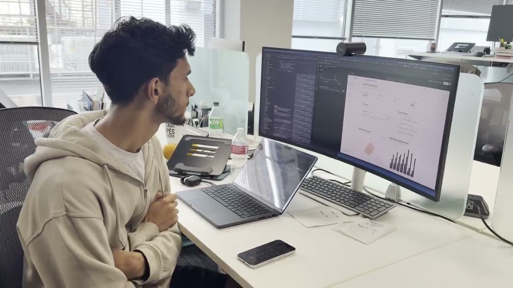
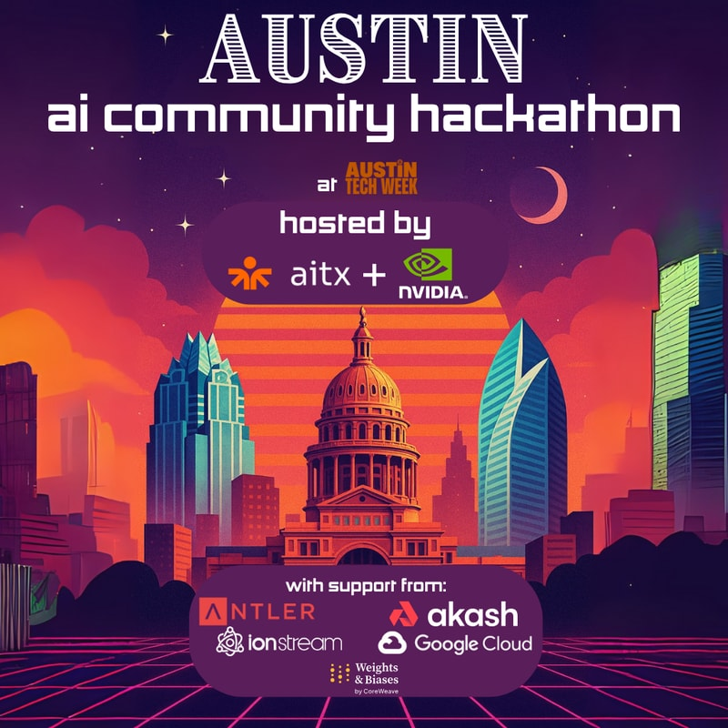
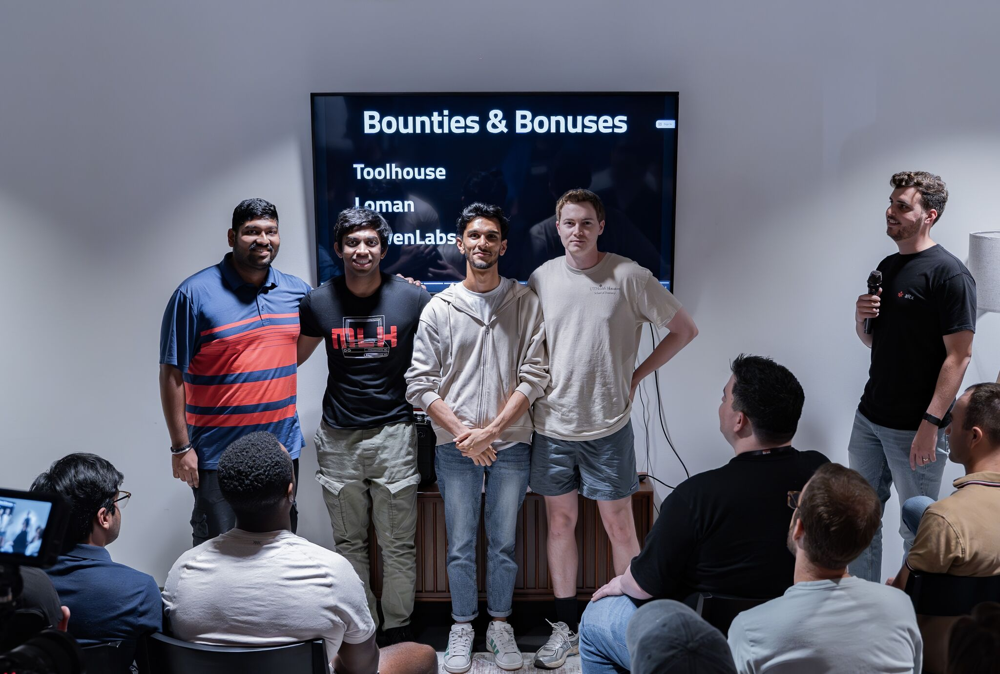
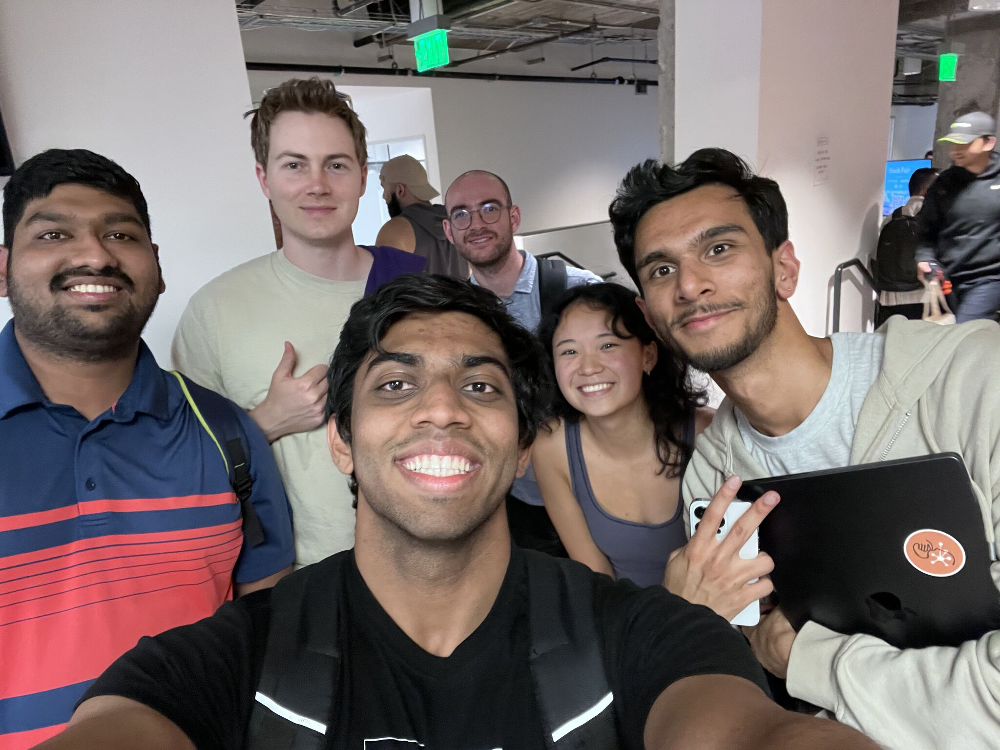
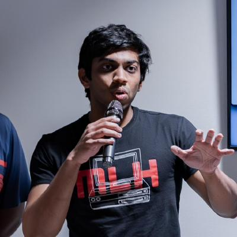

<p align="center">
  
</p>

<h3 align="center">🥇 1st Place · Agentic Track (Weights &amp; Biases)<br>🥇 1st Place · Loman AI Track (Voice AI for Restaurants)</h3>
<p align="center"><i>Austin AI Community Hackathon · Austin Tech Week 2025 · hosted by AITX + NVIDIA</i></p>

<p align="center">
  <a href="https://loyaltie.vercel.app"><b>Website</b></a> ·
  <a href="https://x.com/saksham_adh/status/1982489137111560450"><b>Demo video</b></a> ·
  <a href="#getting-started"><b>Getting started</b></a> ·
  <a href="#team"><b>Team</b></a>
</p>

<p align="center">
  
  
  
  
  
  
  
  
</p>

# Loyaltie: Hyper-Personalized Ordering Agents

**Every regular deserves to be remembered.**

Loyaltie redefines how you order food. Its AI agents know each customer's tastes, budget and team, adapt their tone to the time of day, take the order through to Stripe checkout, and learn something new from every conversation. The demo agent works for Clay Pit, an Austin restaurant, and serves a regular who orders lunch for their whole team every week.

<p align="center">
  <a href="https://x.com/saksham_adh/status/1982489137111560450">
    
  </a>
  <br>
  <sub><b>▶ Watch the 4-minute demo</b> (also on the <a href="https://loyaltie.vercel.app/#demo">website</a>)</sub>
</p>

---

## 🏆 Winning at the Austin AI Community Hackathon

Loyaltie took **first place in two tracks** at the Austin AI Community Hackathon during Austin Tech Week (October 2025), hosted by AITX and NVIDIA:

| Track | Sponsor | What Loyaltie brought |
|---|---|---|
| 🥇 **Agentic Track** | Weights & Biases | A persona-aware agent that runs the full order flow (discover, curate, confirm, check out) and updates its own customer profile afterwards |
| 🥇 **Loman AI Track** | Voice AI for Restaurants | A restaurant ordering agent whose replies are written to be spoken: short, conversational and adapted to the customer's moment |

<table>
  <tr>
    <td width="33%" valign="top">
      
      <p align="center"><sub><b>The event</b></sub></p>
    </td>
    <td width="33%" valign="top">
      
      <p align="center"><sub><b>On stage for the bounty announcements</b></sub></p>
    </td>
    <td width="33%" valign="top">
      
      <p align="center"><sub><b>Celebrating after the awards</b></sub></p>
    </td>
  </tr>
</table>

---

## The Problem

Restaurants know their regulars by face. Their ordering software doesn't know them at all.

- **Every order starts from zero.** Phone lines, chatbots and ordering apps greet a customer on their 47th order like it's their first: same questions, same full menu.
- **The same person isn't the same at 9 AM and 8 PM.** Monday morning calls for a quick decision; Thursday afternoon is for planning a team event; 8 PM is urgent. Most bots answer all of them the same way.
- **Loyalty programs count visits, not people.** Points don't know that you order vegetarian for the team, bike to work, or share the plan in Slack.

## The Idea

Give the agent a **living customer profile** and let it **read the moment**. Loyaltie pairs each customer's profile with the time of day and picks one of four conversation modes:

| Mode | When | How the agent behaves |
|---|---|---|
| **Structured** | Mon–Tue, 8–10 AM | Efficient and to the point. Quick decisions, options in bullets |
| **Balanced** | 11 AM–1 PM | The default working-hours voice: professional, clear, concise |
| **Collaborative** | 4–6 PM | More detail and suggestions. Good for planning team events |
| **Urgent** | 8 PM + | Empathetic and fast. Streamlined choices so dinner is sorted |

## Features

- **Persona-aware conversations.** Identity, communication style, hero dishes, dietary needs, budget comfort range and personal touches are all built into the agent's system prompt.
- **A profile that learns.** After each session the Profile Updater extracts new learnings (addresses, event types, budget patterns, preferences), tags each with a confidence level and an append, replace or merge action, and applies them only after approval, with a backup first.
- **Orders that close themselves.** An order state machine (`chatting → confirming → processing → completed`) drafts the order from the conversation, detects confirmation and hands off to **Stripe Checkout**.
- **Shareable summaries.** When a customer shares plans in Slack, the agent ends with a bullet summary ready to paste.
- **NVIDIA Nemotron with one flag.** `USE_NEMOTRON=true` routes agents to Llama 3.1 Nemotron Ultra (253B) through OpenRouter, and a performance tracker records latency and tokens per second for side-by-side comparison.
- **Sessions and logging.** Every session is persisted with a JSON Lines event log so conversations can be resumed and replayed.

## How it works

```
Recognize  →  Read the room  →  Curate  →  Close  →  Learn
  load the      detect time      hero dishes,  confirm +     propose profile
  profile and   of day, pick     budget,       Stripe        updates for
  order history a mode           headcount     checkout      next time
```

## Tech Stack

| Layer | Technology |
|---|---|
| Agents | OpenAI Agents SDK (`@openai/agents`) |
| Models | GPT-4.1 / GPT-5, or NVIDIA Llama 3.1 Nemotron Ultra via OpenRouter |
| Backend | Node.js + TypeScript, Express with an OpenAPI spec (`server/`) |
| Payments | Stripe Checkout |
| Frontend | Next.js 14, Tailwind CSS (`frontend/`): landing page at `/`, chat app at `/chat` |
| Data | Customer profiles as JSON, order history as CSV, sessions as JSON Lines |

## Getting Started

### 1. Install

```bash
npm install                    # backend + CLIs
cd frontend && npm install     # web app
```

### 2. Configure

Create `.env` in the project root:

```bash
OPENAI_API_KEY=sk-...
STRIPE_SECRET_KEY=sk_test_...          # optional: real Stripe Checkout links
OPENROUTER_API_KEY=sk-or-...           # optional: needed for Nemotron
USE_NEMOTRON=false                     # true to route agents to NVIDIA Nemotron
FRONTEND_URL=http://localhost:3000
```

The frontend reads `NEXT_PUBLIC_API_URL` (defaults to `http://localhost:8000`).

### 3. Run

```bash
# Terminal 1: API server (http://localhost:8000, docs at /api-docs)
npm run server

# Terminal 2: web app (http://localhost:3000, chat at /chat)
cd frontend && npm run dev

# Or talk to the persona agent in the terminal
npm run persona -- --time=evening
```

---

## Team

<table>
  <tr>
    <td align="center" width="33%">
      <br>
      <a href="https://github.com/Tar-ive"><b>Saksham Adhikari</b></a><br>
      <sub>2x Intern @ AskSLM · 6x Hackathon Winner · Google TPU Research Cloud Grantee</sub>
    </td>
    <td align="center" width="33%">
      <br>
      <a href="https://github.com/sharanmurli"><b>Sharan Murli</b></a><br>
      <sub>MS Computer Science @ USC</sub>
    </td>
    <td align="center" width="33%">
      <br>
      <a href="https://github.com/darshanrao"><b>Darshan Rao</b></a><br>
      <sub>University of Southern California</sub>
    </td>
  </tr>
</table>

---

# CLI Reference

The sections below document the command-line tools in `rc/`.

## CLI Tools


### 1. Persona Chat CLI

**Command:** `npm run persona`

**File:** `rc/persona-chat-cli.ts`

An AI customer service agent that adapts its behavior based on customer profiles and time of day.

#### Features

- **Profile-Driven Conversations** - Loads customer preferences from JSON
- **Time-Aware Responses** - Adapts tone and pacing based on time of day
- **Context Modes** - Four distinct interaction modes
- **Colored Terminal Output** - Enhanced UX with ANSI colors
- **Persistent Conversation** - Maintains context across messages
- **Dietary Awareness** - Respects allergies and preferences

#### Time Contexts

**Monday Morning (Mon-Tue 8-10am)**
- Structured, efficient communication
- Quick decision-making
- Minimal small talk

**Midday (11am-1pm, default working hours)**
- Balanced efficiency
- Standard professional tone
- Clear, concise responses

**Late Afternoon (4-6pm)**
- Collaborative mode
- More detailed explanations
- Team-oriented suggestions

**Evening (8pm+)**
- High urgency mode
- Empathetic and rapid
- Streamlined solutions

#### Command-Line Options

```bash
# Auto-detect time context
npm run persona

# Override time context
npm run persona -- --time=monday_morning
npm run persona -- --time=midday
npm run persona -- --time=late_afternoon
npm run persona -- --time=evening
```

#### Customer Profile Structure

Located in `rc/data/aniket_profile.json`:

```json
{
  "customer_id": "aniket_001",
  "identity": {
    "name": "Aniket",
    "age": 32,
    "role": "Engineering Manager",
    "location": "Austin, TX",
    "company": "Tech Corp",
    "commute": "bike",
    "relationship": "VIP customer"
  },
  "communication_style": {
    "tone": "friendly but professional",
    "speech_pattern": "clear and direct",
    "verbosity": "concise",
    "wants": "bullet points for team sharing",
    "humor": "tech analogies welcome"
  },
  "temporal_modes": {
    "monday_morning": {
      "time_range": "Mon-Tue 8-10am",
      "energy": "focused",
      "style": "efficient and structured",
      "approach": "quick decisions"
    },
    ...
  },
  "culinary": {
    "hero_dishes": ["Palak Paneer", "Chicken Tikka Masala"],
    "supporting_dishes": ["Garlic Naan", "Biryani"],
    "beverages": ["Mango Lassi", "Masala Chai"],
    "desserts": ["Gulab Jamun", "Kheer"],
    "dietary_awareness": "Vegetarian-friendly prioritization",
    "allergy_flags": ["None known"],
    "experience_enhancers": "Include chef notes and dish stories"
  },
  "behavior": {
    "budget_comfort_range": [40, 150],
    "typical_budget": 75,
    "expects": "transparent pricing",
    "advance_planning": "prefers 1-day notice",
    "surprise_orders": "occasional spontaneous lunch",
    "feedback_style": "direct and constructive",
    "appreciates": "bulk discounts and sustainability"
  },
  "agent_interaction_blueprint": {
    "greeting": "Use name, acknowledge context",
    "discovery": "Quick questions about event type and headcount",
    "menu_curation": "Lead with hero dishes, explain pairings",
    "storytelling": "Brief chef notes when relevant",
    "closure": "Bullet summary for team sharing",
    "follow_up": "Confirm delivery details"
  },
  "personal_touches": [
    "Mention sustainability (he bikes to work)",
    "Use tech analogies when natural",
    "Provide Slack-friendly summaries",
    "Highlight team lunch options"
  ],
  "day_time_emotional_map": {
    "monday_morning": "Focused on efficiency",
    "midday": "Standard professional mode",
    "late_afternoon": "More collaborative",
    "evening": "Empathetic to urgency"
  }
}
```

#### Example Conversation

```
=== Clay Pit Customer Service Agent ===

Loading customer profile...
Detected time context: Monday Morning - Structured Mode

Customer: Aniket (Engineering Manager)

Agent: Hi! I'm here to help with your order. Type 'exit' to end the conversation.

You: Need lunch for 8 people tomorrow

Agent: Perfect, Aniket! Lunch for 8 tomorrow. To help me curate the right menu:
• What type of event? (team meeting, celebration, casual lunch)
• Any dietary preferences or restrictions?
• Preferred budget per person?

You: Team meeting, vegetarian friendly, around $15/person

Agent: Excellent choice for a team lunch! Here's what I recommend:

**Hero Dishes**
• Palak Paneer (8 servings) - creamy spinach and cottage cheese
• Vegetable Biryani (family size) - aromatic rice with seasonal vegetables

**Sides & Breads**
• Garlic Naan (16 pieces) - perfect for sharing
• Raita (1 quart) - cooling yogurt complement

**Beverages**
• Mango Lassi (8 cups) - sweet and refreshing

**Total**: ~$120 (team discount applied)

**Chef's Note**: The Palak Paneer uses locally-sourced spinach and our house-made paneer. Pairs beautifully with the naan!

**For Your Slack:**
• 8-person vegetarian spread
• Palak Paneer + Veg Biryani (mains)
• Garlic Naan + Raita (sides)
• Mango Lassi (drinks)
• $120 total, delivery tomorrow
• ♻️ Sustainable packaging

Shall I confirm this order?

You: exit

Agent: Thank you! Looking forward to serving you soon.

💡 Tip: Use --time=<context> to simulate different times of day
   Options: monday_morning, midday, late_afternoon, evening
```

#### Agent Behavior

The agent adapts based on:

1. **Customer Identity** - Uses name, role, company context
2. **Time of Day** - Adjusts verbosity and pacing
3. **Culinary Preferences** - Prioritizes hero dishes
4. **Dietary Requirements** - Respects allergies and preferences
5. **Budget Awareness** - Works within comfort range
6. **Communication Style** - Matches customer's preferred format
7. **Personal Touches** - Includes tech analogies, sustainability notes

---

## Architecture

### Technology Stack

- **Runtime**: Node.js with TypeScript
- **AI Framework**: OpenAI Agents SDK (`@openai/agents`)
- **Models**: GPT-5 (ordering workflows), GPT-4.1 (persona chat)
- **Input/Output**: Node.js readline for CLI interaction
- **Data Storage**: CSV files for order history

### Agent Configuration

All agents use:
- **Tracing**: Enabled for debugging and observability
- **Store**: Conversation history stored for context
- **Reasoning**: Low effort for fast responses
- **Temperature**: 0.8 for persona chat (natural conversation)

### File Structure

```
loyaltie/
├── rc/
│   ├── data/
│   │   └── aniket_profile.json        # Customer profile example
│   ├── orders/
│   │   ├── chat-ordering-cli.ts       # Main interactive ordering CLI
│   │   └── chat-ordering-workflow.ts  # Workflow engine & agent definitions
│   ├── persona-agent.ts               # Persona logic & prompt building
│   └── persona-chat-cli.ts            # Persona-aware customer service CLI
├── orders.csv                    # Order history
├── order_details.csv             # Detailed order records
├── package.json                  # Dependencies & scripts
└── docs/                         # Todo
```

### Data Flow

#### Chat Ordering CLI
```
User Input
  ↓
Greeting Agent → Extract name & initial request
  ↓
Classification (bulk/single)
  ↓
Load History (if bulk) + Ordering Agent → Extract items & metadata
  ↓
Upsell Logic
  ↓
User Confirmation
  ↓
Finalizer Agent → Generate receipt
  ↓
Output to user
```

#### Persona Chat CLI
```
Load Customer Profile
  ↓
Detect/Override Time Context
  ↓
Build Dynamic System Prompt
  ↓
Initialize Agent with Profile
  ↓
User Message
  ↓
Agent Response (context-aware)
  ↓
Update Conversation History
  ↓
Loop until exit
```

---

## Development

### Running in Development

```bash
# Install dependencies
npm install

# Run with TypeScript execution
npx tsx rc/orders/chat-ordering-cli.ts
npx tsx rc/orders/chat-ordering-workflow.ts "your order here"
npx tsx rc/persona-chat-cli.ts --time=evening
```

### Environment Variables

The tools use OpenAI's agent framework which requires:
- OpenAI API key (set via standard OpenAI environment variables)
- Agent tracing configured (optional, for debugging)

### Adding Customer Profiles

Create new JSON profiles in `rc/data/` following the structure of `aniket_profile.json`.

Update `persona-agent.ts` to load the appropriate profile:

```typescript
export async function loadCustomerProfile(customerId: string): Promise<AniketProfile> {
  const profilePath = path.resolve(__dirname, "data", `${customerId}_profile.json`);
  const raw = await fs.readFile(profilePath, "utf8");
  return JSON.parse(raw);
}
```

### Customizing Agents

Edit agent configurations in `rc/orders/chat-ordering-workflow.ts`:

```typescript
export const ordering = new Agent({
  name: "Ordering",
  instructions: "Your custom instructions here...",
  model: "gpt-5",
  modelSettings: {
    reasoning: { effort: "medium" },  // Adjust reasoning effort
    temperature: 0.7,                  // Adjust creativity
    store: true
  },
});
```

---

## Troubleshooting

### CLI Not Starting

**Issue**: `npm run chat` fails to start

**Solution**:
```bash
npm install
npx tsx chat-ordering-cli.ts
```

### Agent Response Errors

**Issue**: "Agent result is undefined"

**Cause**: API key not configured or model unavailable

**Solution**: Ensure OpenAI API key is set and model access is configured

### CSV Files Not Found

**Issue**: Order history not loading

**Solution**: Ensure `orders.csv` and `order_details.csv` are in the project root

### Profile Loading Fails

**Issue**: Persona chat can't load profile

**Solution**:
```bash
# Check profile exists
ls rc/data/aniket_profile.json

# Validate JSON syntax
npx tsx -e "console.log(require('./rc/data/aniket_profile.json'))"
```

---

## Future Enhancements

- [ ] Multi-customer profile support in persona CLI
- [ ] Database integration (replace CSV files)
- [x] Web interface for CLIs (`frontend/`)
- [ ] Voice input/output (speech-to-text and text-to-speech)
- [ ] Order tracking and status updates
- [x] Payment processing integration (Stripe Checkout)
- [ ] Analytics dashboard for order patterns
- [ ] Multi-language support
- [ ] Menu management system
- [ ] Inventory tracking

---

## License

ISC
